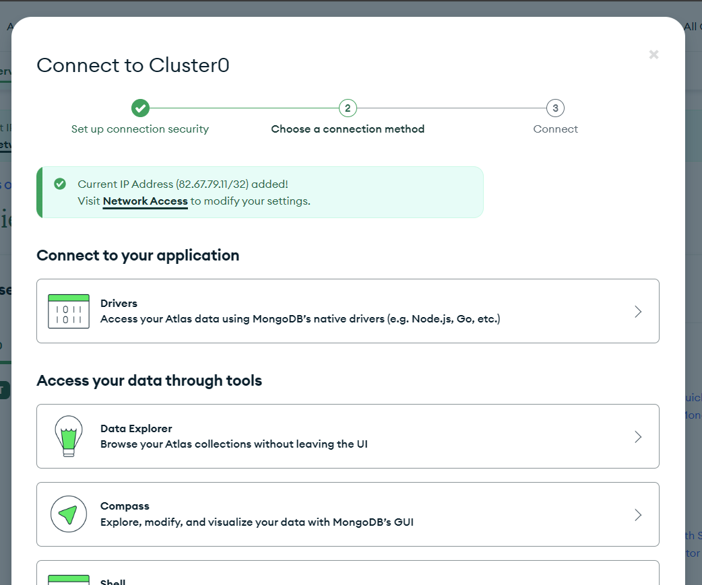
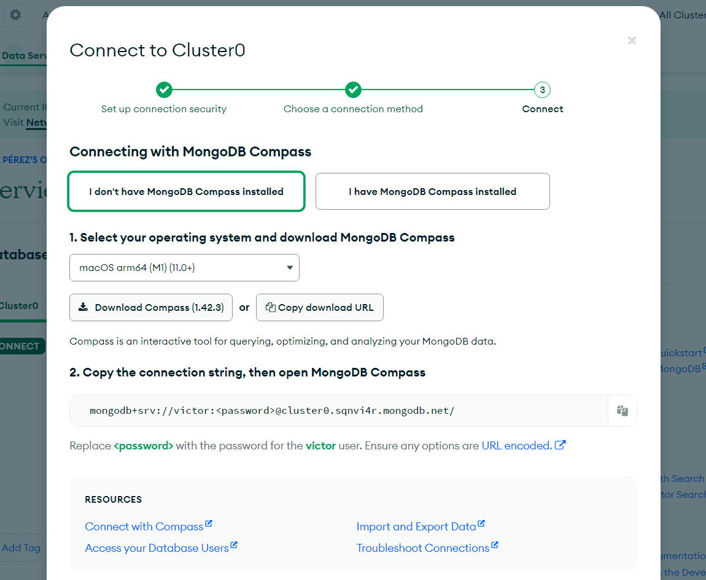
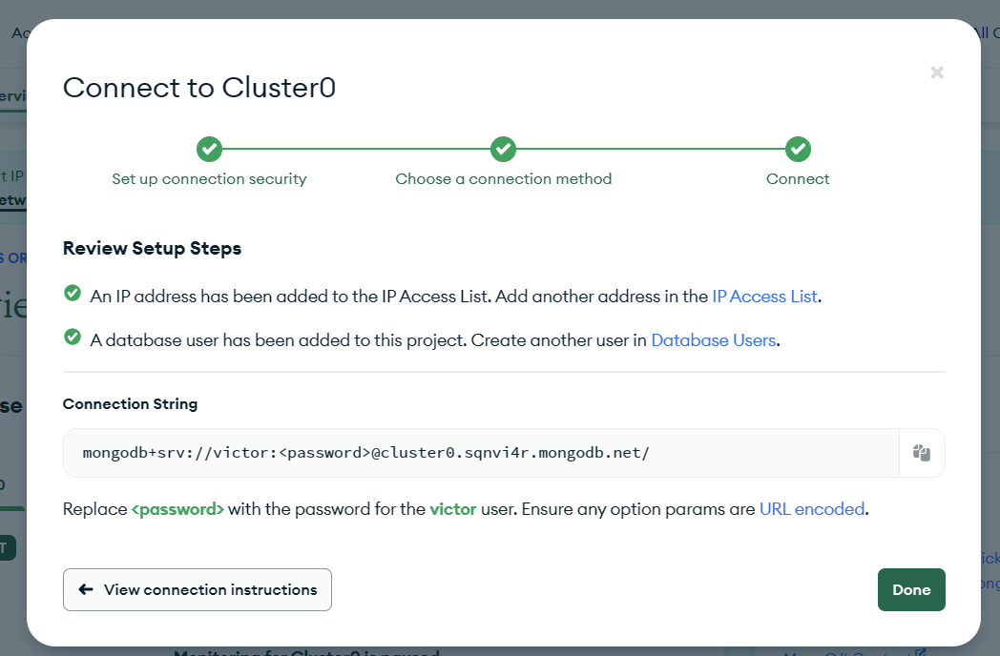

# Rapport de projet

## TD 2
<!-- json data représentant post, category et users -->

```json

{
  "users": [
    {
      "id": 1,
      "username": "user1",
      "name": "John Doe",
      "email": "john@example.com"
    },
    {
      "id": 2,
      "username": "user2",
      "name": "Jane Smith",
      "email": "jane@example.com"
    }
  ],
  "categories": [
    {
      "id": 1,
      "name": "Technology"
    },
    {
      "id": 2,
      "name": "Travel"
    }
  ],
  "posts": [
    {
      "id": 1,
      "title": "Introduction to JavaScript",
      "content": "Lorem ipsum dolor sit amet, consectetur adipiscing elit.",
      "category_id": 1,
      "user_id": 1
    },
    {
      "id": 2,
      "title": "Tips for Traveling on a Budget",
      "content": "Lorem ipsum dolor sit amet, consectetur adipiscing elit.",
      "category_id": 2,
      "user_id": 2
    },
    {
      "id": 3,
      "title": "Advanced CSS Techniques",
      "content": "Lorem ipsum dolor sit amet, consectetur adipiscing elit.",
      "category_id": 1,
      "user_id": 1
    }
  ]
}
```

### Proposition pour l'ajout des commentaires images et texte

```json
{
  "users": [
    {
      "id": 1,
      "username": "user1",
      "name": "John Doe",
      "email": "john@example.com"
    },
    {
      "id": 2,
      "username": "user2",
      "name": "Jane Smith",
      "email": "jane@example.com"
    }
  ],
  "categories": [
    {
      "id": 1,
      "name": "Technology"
    },
    {
      "id": 2,
      "name": "Travel"
    }
  ],
  "posts": [
    {
      "id": 1,
      "title": "Introduction to JavaScript",
      "content": "Lorem ipsum dolor sit amet, consectetur adipiscing elit.",
      "category_id": 1,
      "user_id": 1,
      "comments": [
        {
          "id": 1,
          "text": "Great post! Thanks for sharing.",
          "image": "https://example.com/comment_image1.jpg",
          "user_id": 2
        }
      ]
    },
    {
      "id": 2,
      "title": "Tips for Traveling on a Budget",
      "content": "Lorem ipsum dolor sit amet, consectetur adipiscing elit.",
      "category_id": 2,
      "user_id": 2,
      "comments": [
        {
          "id": 2,
          "text": "Very helpful tips!",
          "image": "https://example.com/comment_image2.jpg",
          "user_id": 1
        },
        {
          "id": 3,
          "text": "I'll definitely try these on my next trip.",
          "image": null,
          "user_id": 1
        }
      ]
    },
    {
      "id": 3,
      "title": "Advanced CSS Techniques",
      "content": "Lorem ipsum dolor sit amet, consectetur adipiscing elit.",
      "category_id": 1,
      "user_id": 1,
      "comments": []
    }
  ]
}

```

### Json Path

    1- Requête json path qui donne en sortie les entries des posts
        - $.posts[*]

    2- Une requête qui donne les users des posts
        - $.posts[*].user_id
    
    3- Une requête qui donne les commentaires des posts
        - $.posts[*].comments[*]
    
    4- une requête qui donne les textes des commentaires
        - $.posts[*].comments[*].text

## TD 3

- Compte mongodb Atlas
  - configuration de compass

|||
|---|---|
|  |
||


fonction 
  
  ```javascript

const postSchema = require('../Models/Post')
const mongoose = require('mongoose')
const postModel = mongoose.model('posts', postSchema)

 async function getAllPosts (req, res) {
    // Logic to fetch all posts from the database
    let data = await postModel.find().populate('comments').exec()
    console.log(data)
    res.send(data)
  }
  
  async function   createPost(req, res) {
    // Logic to create a new post
    const postData = {
      entry: req.body.entry,
      categories: req.body.categories,
      comments: req.body.comments
  };
    const newPost = new postModel(postData)
    const data = await newPost.save()
    res.send(data) 
  }
  
  async function  getPostById(req, res) {
    // Logic to fetch a post by ID
    const id = req.params.id
    let data = await postModel.findById(id).populate('comments').exec()
    res.send(data)
  }
  
  async function   updatePost(req, res) {
    // Logic to update a post
    const id = req.params.id
    const postData = {
      entry: req.body.entry,
      categories: req.body.categories,
      comments: req.body.comments
  };
  console.log(postData)
    let data = await postModel.findByIdAndUpdate(id, {$set: postData}, {new:true})
    res.send(data);
}
  
async function   deletePost(req, res) {
    // Logic to delete a post
    const id = req.params.id
    let data = await postModel.findByIdAndDelete(id)
    res.send(data)
  }

  module.exports = {
    getAllPosts,
    createPost,
    getPostById,
    updatePost,
    deletePost
};

```

## TD 4

- Création de l'API RESTful
  - Utilisation de Postman pour tester les différentes routes
  - Utilisation de MongoDB Compass pour visualiser les données

```javascript
// Routes du post
const express = require('express');
const router = express.Router();

// Import controllers
const PostController = require('../Services/Post');

// Define routes
router.get('/', PostController.getAllPosts);
router.post('/', PostController.createPost);
router.get('/:id', PostController.getPostById);
router.put('/:id', PostController.updatePost);
router.delete('/:id', PostController.deletePost);

module.exports = router;
```

## TD 5

- ajout de la collection comments

```javascript
const mongoose = require('mongoose');
const Schema = mongoose.Schema;

const commentSchema = new Schema({
  text: {
    type: String,
    required: true
  }
});

module.exports = commentSchema;
```

- ajout de la collection post

```javascript
const mongoose = require('mongoose');
const Schema = mongoose.Schema;
const commentSchema = require('./Comment');

const postSchema = new Schema({
  entry: {
    type: String,
    required: true
  },
  categories: {
    type: [String],
    required: true
  },
  comments: {
    type: [commentSchema],
    default: []
  }
});

module.exports = postSchema;
```

- creationd'un post et commentaire

```javascript

// Créer un Post avec commentaire

async function   createPost(req, res) {
    // Logic to create a new post
    const postData = {
      entry: req.body.entry,
      categories: req.body.categories,
      comments: req.body.comments
  };
    const newPost = new postModel(postData)
    const data = await newPost.save()
    res.send(data) 
  }
```
